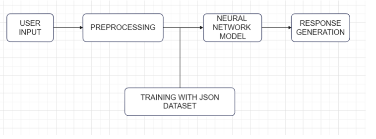
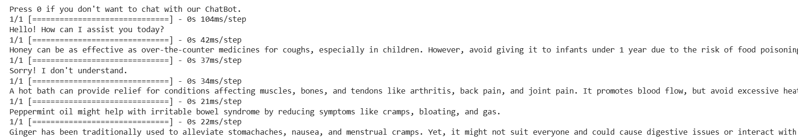

# Home Remedy Recommendation Chatbox

This project is a simple chatbot implemented in Python that suggests home remedies based on user input queries. It utilizes Natural Language Processing (NLP) techniques and a neural network model to classify user queries and provide relevant home remedy recommendations.

## Requirements

- Python 3.x
- Required Python packages: nltk, numpy, tensorflow

## Features
-Dataset Loading: The code mounts a Google Drive and loads a dataset (dataset.json) containing intents and corresponding examples related to home remedies.
-Data Preprocessing: The script tokenizes text, lemmatizes words, creates a bag-of-words representation, and prepares the dataset for training.
-Neural Network Model: Utilizes TensorFlow/Keras to create a sequential neural network model for classification tasks. The model architecture comprises multiple dense layers with dropout for reducing overfitting.
-Training and Model Summary: Trains the neural network model using the prepared dataset, displaying the model architecture summary and training logs (loss and accuracy) for each epoch.
-Prediction and Response Generation: Provides functions for predicting classes based on user input messages, retrieving responses related to predicted classes from the dataset, and generating appropriate chatbot responses.


## Architecture Diagram/Flow



## Installation

1. Clone the repository:

   ```shell
   git clone https://github.com/Hariharan-061102/chatbot-for-home-remedy-recommendation.git

2. Install the required packages:
      tensorflow
      punkt
      wordnet
3. import the json dataset.
4. Run the Code.

## Usage

-Mount Google Drive:
Run the code snippet in a Google Colab environment to mount your Google Drive.
Ensure the presence of a dataset file named dataset.json within the specified drive path (/content/drive/My Drive/chat__bot).

-Data Preparation and Model Training:
The code automatically preprocesses the dataset, creates a neural network model, and trains it on the prepared dataset for 150 epochs.
Check the model summary and training logs to assess the training progress and performance.

-Interacting with the Chatbot:
After the training phase, the script allows interaction with the chatbot through the console.
Input your queries or messages to the chatbot, and it will predict relevant intents based on the trained model.
The chatbot will respond with recommendations or appropriate responses related to the predicted intent.

-Exit Chatbot:
Enter "0" to exit the chatbot interaction loop.

## Program:

```python
from google.colab import drive
drive.mount('/content/drive')
data_root='/content/drive/My Drive/chat__bot'

import json
import string
import random

import nltk
import numpy as np
from nltk.stem import WordNetLemmatizer
import tensorflow as tf
from tensorflow.keras import Sequential
from tensorflow.keras.layers import Dense,Dropout
nltk.download("punkt")
nltk.download("wordnet")

data_file=open(data_root + '/dataset.json').read()
data=json.loads(data_file)

words=[]
classes=[]
data_X=[]
data_Y=[]

for intent in data["intents"]:
  for pattern in intent["examples"]:
    tokens=nltk.word_tokenize(pattern)
    words.extend(tokens)
    data_X.append(pattern)
    data_Y.append(intent["name"]),
  if intent["name"] not in classes:
    classes.append(intent["name"])

lemmatizer=WordNetLemmatizer()
words=[lemmatizer.lemmatize(word.lower()) for word in words if word not in string.punctuation]
words=sorted(set(words))
classes=sorted(set(classes))

training=[]
out_empty=[0]*len(classes)
for idx,doc in enumerate(data_X):
  bow=[]
  text=lemmatizer.lemmatize(doc.lower())
  for word in words:
    bow.append(1) if word in text else bow.append(0)
  output_row=list(out_empty)
  output_row[classes.index(data_Y[idx])]=1
  training.append([bow,output_row])
random.shuffle(training)
training=np.array(training,dtype=object)
train_X=np.array(list(training[:,0]))
train_Y=np.array(list(training[:,1]))

model=Sequential()
model.add(Dense(128,input_shape=(len(train_X[0]),),activation="relu"))
model.add(Dropout(0.5))
model.add(Dense(64,activation="relu"))
model.add(Dropout(0.5))
model.add(Dense(len(train_Y[0]),activation="softmax"))
adam=tf.keras.optimizers.legacy.Adam(learning_rate=0.01,decay=1e-6)
model.compile(loss='categorical_crossentropy',optimizer=adam,metrics=["accuracy"])
print(model.summary())
model.fit(x=train_X,y=train_Y,epochs=150,verbose=1)

def clean_text(text):
  tokens=nltk.word_tokenize(text)
  tokens=[lemmatizer.lemmatize(word) for word in tokens]
  return tokens

def bag_of_words(text,vocab):
  tokens=clean_text(text)
  bow=[0] *len(vocab)
  for w in tokens:
    for idx,word in enumerate(vocab):
      if word== w:
        bow[idx]=1
  return np.array(bow)

def pred_class(text,vocab,labels):
  bow=bag_of_words(text,vocab)
  result=model.predict(np.array([bow]))[0]
  thresh=0.5
  y_pred=[[indx,res] for indx,res in enumerate(result) if res > thresh]
  y_pred.sort(key=lambda x: x[1], reverse=True)
  return_list=[]
  for r in y_pred:
    return_list.append(labels[r[0]])
  return return_list

def get_response(intents_list,intents_json):
  if len(intents_list)==0:
    result = "Sorry! I don't understand."
  else:
    tag=intents_list[0]
    list_of_intents=intents_json["intents"]
    for i in list_of_intents:
      if i["name"] == tag:
        result=random.choice(i["responses"])
        break
  return result

print("Press 0 if you don't want to chat with our ChatBot.")
while True:
  message=input("")
  if message == "0":
    break
  intents=pred_class(message,words,classes)
  result=get_response(intents,data)
  print(result)

```
## Output:



## Result:

Thus a python code is implemented using Neural Network Model and Natural language Processing Tool Kit for Home remedy recommendation chatbot using a json dataset file.


